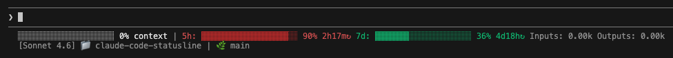

# claude-code-statusline

## 安裝

### 複製statusline.sh到~/.claude目錄下

```bash
cp ./statusline.sh ~/.claude/statusline.sh
```

### 新增設定

```bash
# 新增以下設定參數到~/.claude/settings.json
{
  "statusLine": {
    "type": "command",
    "command": "~/.claude/statusline.sh"
  }
}
```

## 結果預覽
